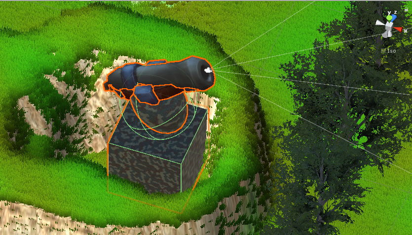
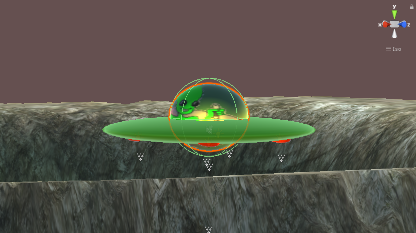

# UFO ATTACK 3D

This is demo version of my first ever 3D game named ufo-attack 3D. 

## Game design

Game was created using only free assets from Unity store, and some geometrical shapes combined.

Sound:
I trimmed sound effects from youtube videos.

   ### Examples

Anti-aircraft gun: cube, sphere, and part of another gun from store.  

UFO - spheres

## Scenario
Story is pretty simple (as you already assumed), aliens are trying to populate the planet earth while they face resistance from ground troops (anti-aircraft guns, booby traps) is tring to put them away. To make game more challenging i added countdown timer.

## Gameplay
In folder screenshots you can look at .gif files that actually shows the gameplay.

